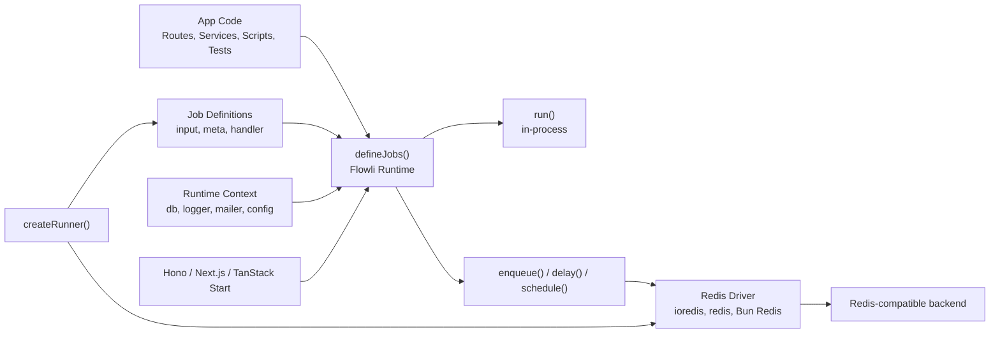
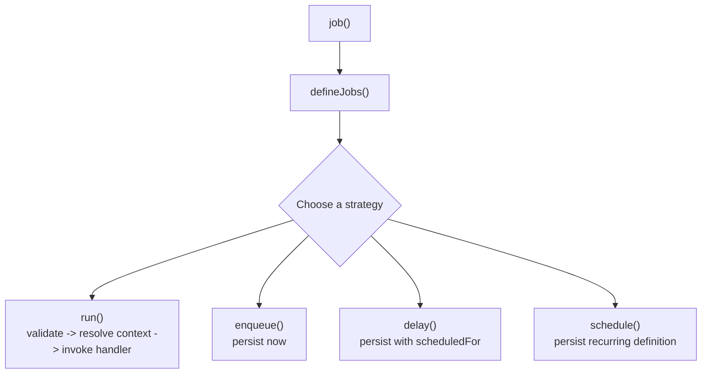
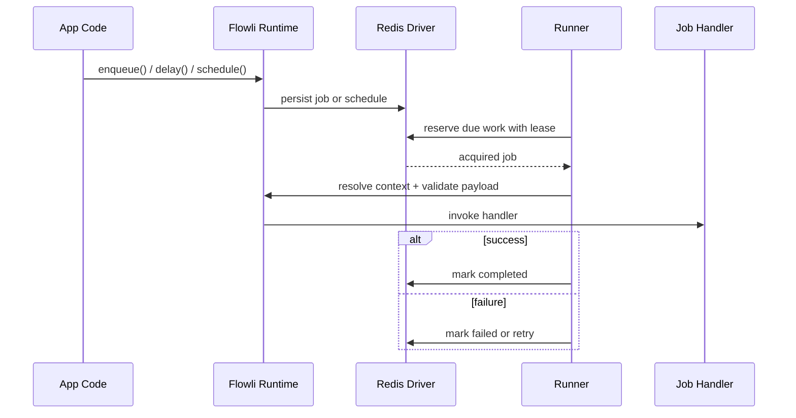

# Flowli

**Typed jobs for modern TypeScript backends.**

[npm](https://www.npmjs.com/package/flowli) · [JSR](https://jsr.io/@alialnaghmoush/flowli) · [GitHub](https://github.com/alialnaghmoush/flowli)

Flowli is a jobs runtime with a code-first API, first-class execution strategies, runtime-scoped context injection, and pluggable Redis drivers.

Define jobs once. Run them anywhere.

## Navigate

- [Why Flowli](#why-flowli)
- [Compare](#compare)
- [What It Feels Like](#what-it-feels-like)
- [The Core Idea](#the-core-idea)
- [Primary Authoring Path](#primary-authoring-path)
- [`run()` Works Without Infrastructure](#run-works-without-infrastructure)
- [Rich Example](#rich-example)
- [Context vs Meta](#context-vs-meta)
- [Async Execution](#async-execution)
- [Runner](#runner)
- [Async Semantics](#async-semantics)
- [Reusable Predeclared Jobs](#reusable-predeclared-jobs)
- [Hono](#hono)
- [Next.js](#nextjs)
- [TanStack Start](#tanstack-start)
- [Install](#install)
- [Production](#production)
- [What Flowli Optimizes For](#what-flowli-optimizes-for)
- [Exports](#exports)
- [Status](#status)

## Why Flowli

Most job systems make one of these tradeoffs:

- great queues, weak TypeScript ergonomics
- strong typing, but framework lock-in
- easy background work, but awkward direct execution in app code and tests

Flowli is built around a different model:

- author jobs like application code, not infrastructure config
- keep `context` centralized in the runtime
- use the same job surface in route handlers, scripts, tests, and workers
- choose execution strategy per call: `run`, `enqueue`, `delay`, `schedule`
- swap Redis clients without rewriting job definitions

It is a typed runtime for background and deferred execution with a code-first, framework-agnostic design.

## Compare

Choose Flowli when you want:

- application-first jobs authored in code, not in a dashboard
- a single runtime that supports both direct execution and persisted async work
- typed `context` injection without framework lock-in
- pluggable Redis clients behind a small API surface

Flowli vs BullMQ:

- Flowli centers the typed job-definition experience; BullMQ centers queue primitives and worker infrastructure
- Flowli makes `run()` a first-class in-process path; BullMQ is primarily queue-first

Flowli vs Trigger.dev:

- Flowli stays library-first and infrastructure-light
- Trigger.dev is stronger when you want a hosted platform, dashboard, and workflow operations out of the box

Flowli vs Inngest:

- Flowli is better suited when you want application-local jobs and direct runtime wiring
- Inngest is stronger when you want event-first workflows across services



## What It Feels Like

```ts
import * as v from "valibot";
import { defineJobs } from "flowli";
import { ioredisDriver } from "flowli/ioredis";

export const flowli = defineJobs({
  driver: ioredisDriver({
    client: redis,
    prefix: "app",
  }),
  context: async () => ({
    db,
    schema,
    logger,
    mailer,
  }),
  jobs: ({ job }) => {
    const auditLogSchema = v.object({
      entityType: v.string(),
      entityId: v.string(),
      action: v.string(),
      message: v.string(),
    });

    const auditLogMetaSchema = v.object({
      requestId: v.string(),
      actorId: v.optional(v.string()),
    });

    const notificationEmailSchema = v.object({
      email: v.string(),
      subject: v.string(),
      message: v.string(),
    });

    return {
      createAuditLog: job("create_audit_log", {
        input: auditLogSchema,
        meta: auditLogMetaSchema,
        handler: async ({ input, ctx, meta }) => {
          await ctx.db.insert(ctx.schema.auditLogs).values({
            entityType: input.entityType,
            entityId: input.entityId,
            action: input.action,
            message: input.message,
            requestId: meta?.requestId,
            actorId: meta?.actorId ?? null,
          });

          ctx.logger.info({
            job: "create_audit_log",
            requestId: meta?.requestId,
            entityId: input.entityId,
          });
        },
      }),

      sendNotificationEmail: job("send_notification_email", {
        input: notificationEmailSchema,
        handler: async ({ input, ctx }) => {
          await ctx.mailer.send({
            to: input.email,
            subject: input.subject,
            text: input.message,
          });
        },
      }),
    };
  },
});
```

Then use it where the work happens:

```ts
await flowli.createAuditLog.run(
  {
    entityType: "invoice",
    entityId: "inv_123",
    action: "invoice.created",
    message: "Invoice created",
  },
  {
    meta: {
      requestId: "req_123",
      actorId: "user_123",
    },
  },
);

await flowli.sendNotificationEmail.enqueue({
  email: "sam@example.com",
  subject: "Flowli event received",
  message: "A new invoice was created.",
});

await flowli.sendNotificationEmail.delay("10m", {
  email: "sam@example.com",
  subject: "Delayed follow-up",
  message: "This is your delayed notification.",
});

await flowli.sendNotificationEmail.schedule({
  cron: "0 8 * * *",
  input: {
    email: "sam@example.com",
    subject: "Daily digest",
    message: "Here is your daily digest.",
  },
});
```

## The Core Idea

Flowli is built around four primitives:

1. `job()`
   Define one unit of work with typed `input`, optional typed `meta`, and a handler.
2. `defineJobs()`
   Bind jobs to a runtime `context`, optional driver, and shared defaults.
3. execution strategies
   Choose `run`, `enqueue`, `delay`, or `schedule` per invocation.
4. optional async runtime
   Attach `createRunner({ flowli })` only when you want persisted async processing.



## Primary Authoring Path

The canonical Flowli path is runtime-first:

```ts
// src/flowli/index.ts
import * as v from "valibot";
import { defineJobs } from "flowli";

export const flowli = defineJobs({
  context: {
    logger,
    db,
  },
  jobs: ({ job }) => {
    const auditLogSchema = v.object({
      entityId: v.string(),
      action: v.string(),
    });

    const auditLogMetaSchema = v.object({
      requestId: v.string(),
    });

    return {
      createAuditLog: job("create_audit_log", {
        input: auditLogSchema,
        meta: auditLogMetaSchema,
        handler: async ({ input, ctx, meta }) => {
          await ctx.db.insert("audit_logs").values({
            entityId: input.entityId,
            action: input.action,
            requestId: meta?.requestId,
          });

          ctx.logger.info({
            entityId: input.entityId,
            action: input.action,
          });
        },
      }),
    };
  },
});
```

This keeps the mental model clean:

- runtime `context` is defined in one place
- jobs are authored against that runtime
- handlers receive typed `ctx`
- app wiring stays separate from business logic

## `run()` Works Without Infrastructure

`run()` is intentionally independent of drivers, queues, leases, and runner state.

That makes Flowli useful in:

- route handlers
- CLI scripts
- local development
- unit tests
- synchronous side-effect flows

```ts
await flowli.createAuditLog.run(
  {
    entityId: "record_1",
    action: "record.created",
  },
  {
    meta: {
      requestId: "req_1",
    },
  },
);
```

## Rich Example

A realistic service can use both direct execution and background work from the same runtime:

```ts
// src/services/create-record.ts
import { flowli } from "../flowli";

export async function createRecord(input: {
  title: string;
  description?: string;
}) {
  const [record] = await db
    .insert(schema.records)
    .values({
      title: input.title,
      description: input.description ?? null,
    })
    .returning();

  await flowli.createAuditLog.run(
    {
      entityType: "record",
      entityId: String(record.id),
      action: "record.created",
      message: `Record "${record.title}" was created`,
    },
    {
      meta: {
        requestId: "req_123",
        actorId: "user_123",
      },
    },
  );

  await flowli.sendNotificationEmail.enqueue({
    email: "owner@example.com",
    subject: "Record created",
    message: `A new record named "${record.title}" is ready.`,
  });

  return record;
}
```

One job surface. Multiple execution modes. Same typing story.

## Context vs Meta

This separation is intentional and important.

Use `context` for runtime-scoped dependencies:

- `db`
- `schema`
- `logger`
- `mailer`
- `storage`
- `config`

Use `meta` for invocation-scoped values:

- `requestId`
- `actorId`
- `locale`
- `tenantId`
- `traceId`

In short:

- `context` is infrastructure and shared services
- `meta` is request or invocation data

## Async Execution

To persist jobs, add a driver:

```ts
import * as v from "valibot";
import { defineJobs } from "flowli";
import { ioredisDriver } from "flowli/ioredis";

export const flowli = defineJobs({
  driver: ioredisDriver({
    client: redis,
    prefix: "app",
  }),
  context: async () => ({
    db,
    logger,
    mailer,
  }),
  jobs: ({ job }) => {
    const emailInputSchema = v.object({
      email: v.string(),
      subject: v.string(),
    });

    return {
      sendEmail: job("send_email", {
        input: emailInputSchema,
        handler: async ({ input, ctx }) => {
          await ctx.mailer.send({
            to: input.email,
            subject: input.subject,
          });
        },
      }),
    };
  },
});
```

Flowli supports:

- `flowli/ioredis`
- `flowli/redis`
- `flowli/bun-redis`

The job definitions stay the same. Only the driver changes.

## Runner

The runner is explicit and secondary by design.

Flowli is not a worker-first framework. The story stays:

- define jobs
- configure Flowli
- optionally attach a runner

```ts
import { createRunner } from "flowli/runner";

const runner = createRunner({
  flowli,
  concurrency: 5,
  pollIntervalMs: 1_000,
  leaseMs: 30_000,
});

await runner.runOnce();
await runner.start();
await runner.stop();
```

`createRunner()` consumes an existing runtime. It does not recreate jobs or rebuild context.

## Async Semantics

Persisted execution in Flowli is:

- at-least-once
- lease-based
- retry-capable
- idempotency-sensitive

Handlers that run asynchronously should be safe to run more than once.



## Reusable Predeclared Jobs

If you want shareable job modules outside the runtime declaration, Flowli supports that too.

This is the advanced path:

```ts
import * as v from "valibot";
import { defineJobs, job } from "flowli";

type AppContext = {
  logger: {
    info(payload: unknown): void;
  };
};

const auditLogSchema = v.object({
  entityId: v.string(),
});

export const createAuditLog = job.withContext<AppContext>()(
  "create_audit_log",
  {
    input: auditLogSchema,
    handler: async ({ input, ctx }) => {
      ctx.logger.info(input.entityId);
    },
  },
);

export const flowli = defineJobs.withContext<AppContext>()({
  jobs: { createAuditLog },
  context: {
    logger,
  },
});
```

When you use this path, Flowli checks at compile time that the runtime `context` satisfies the predeclared job requirements.

## Hono

Attach an existing runtime to Hono without creating a second abstraction:

```ts
import { honoJobs } from "flowli/hono";

app.use("*", honoJobs(flowli));
```

## Next.js

Use the same configured runtime in route handlers and server actions without rebuilding anything:

```ts
// app/api/audit/[entityId]/route.ts
import { nextAction, nextRoute } from "flowli/next";
import { flowli } from "@/src/flowli";

export const POST = nextRoute(
  flowli,
  async ({ request, flowli, params }) => {
    const body = await request.json();

    await flowli.createAuditLog.run(
      {
        entityType: body.entityType ?? "record",
        entityId: params?.entityId ?? body.entityId,
        action: body.action ?? "record.updated",
        message: "Audit event received from route handler",
      },
      {
        meta: {
          requestId: request.headers.get("x-request-id") ?? "unknown",
        },
      },
    );

    return Response.json({ ok: true });
  },
);
```

```ts
// app/actions/send-notification.ts
export const sendNotificationAction = nextAction(
  flowli,
  async ({ flowli }, formData: FormData) => {
    await flowli.sendNotificationEmail.enqueue({
      email: String(formData.get("email")),
      subject: String(formData.get("subject")),
      message: String(formData.get("message")),
    });
  },
);
```

`flowli/next` stays lightweight:

- no second runtime
- no hidden global registry
- no direct dependency on Next internals inside your jobs
- works with an already configured `flowli` instance

## TanStack Start

Use the same configured runtime in TanStack Start server routes and server functions:

```ts
// src/routes/api/audit.$entityId.ts
import { createFileRoute } from "@tanstack/react-router";
import { tanstackStartRoute } from "flowli/tanstack-start";
import { flowli } from "@/src/flowli";

export const Route = createFileRoute("/api/audit/$entityId")({
  server: {
    handlers: {
      POST: tanstackStartRoute(
        flowli,
        async ({ request, params, flowli }) => {
          const body = await request.json();

          await flowli.createAuditLog.run({
            entityType: body.entityType ?? "record",
            entityId: params.entityId,
            action: body.action ?? "record.updated",
            message: "Audit event received from TanStack Start",
          });

          return Response.json({ ok: true });
        },
      ),
    },
  },
});
```

```ts
// src/lib/notifications.functions.ts
import { createServerFn } from "@tanstack/react-start";
import { tanstackStartServerFn } from "flowli/tanstack-start";
import { flowli } from "@/src/flowli";

export const sendNotification = createServerFn({ method: "POST" }).handler(
  tanstackStartServerFn(
    flowli,
    async ({ flowli, data }: { data: { email: string; subject: string } }) => {
      await flowli.sendNotificationEmail.enqueue({
        email: data.email,
        subject: data.subject,
        message: "Triggered from a TanStack Start server function.",
      });
    },
  ),
);
```

`flowli/tanstack-start` stays lightweight:

- no second runtime
- no hidden registry
- no framework state inside your job definitions
- works with existing TanStack Start server route and server function patterns

## Install

```bash
npm install flowli
```

```bash
pnpm add flowli
```

```bash
bun add flowli
```

Optional schema peers:

```bash
bun add valibot zod
```

Optional framework peers:

```bash
bun add next
```

```bash
bun add @tanstack/react-start
```

Optional Redis client peers:

```bash
bun add ioredis
```

```bash
bun add redis
```

Real Redis integration testing:

```bash
bun run docker:up
```

```bash
bun run test:redis:docker
```

```bash
bun run docker:down
```

## Production

Flowli is close to production use, but its async model is explicit and you should deploy it like queue infrastructure, not just a helper library.

Recommended production baseline:

- run a dedicated `createRunner({ flowli })` process
- use Redis/Valkey/Dragonfly with persistence configured appropriately for your durability needs
- keep handlers idempotent because persisted execution is at-least-once
- tune `leaseMs`, `concurrency`, and `maxJobsPerTick` to match handler duration and load
- monitor failed jobs and handler error rates
- validate delayed and scheduled workloads against real infrastructure before rollout

Operational notes:

- `run()` is in-process and does not depend on Redis
- `enqueue()`, `delay()`, and `schedule()` depend on a configured driver
- async work is lease-based and can be retried after failures or lease recovery
- if a runner crashes after reserving work, expired leases are recovered and jobs are re-queued
- schedule execution is UTC-based in v1

Suggested rollout plan:

1. Start with `run()` in app code and tests.
2. Enable `enqueue()` with one runner process.
3. Verify handler idempotency and retry behavior.
4. Add delayed and scheduled workloads after observing real job throughput and failure patterns.

For local real-backend validation, Flowli ships a Redis setup in [docker-compose.yml](/Users/alialnaghmoush/Documents/GitHub/flowli/docker-compose.yml). The default local test URL is `redis://127.0.0.1:6379/0`, which matches `bun run test:redis:docker`.

## What Flowli Optimizes For

- small API surface
- explicit runtime wiring
- strong autocomplete
- clean context injection
- type-safe invocation surfaces
- tree-shakable subpath exports
- framework-agnostic core design

## Exports

- `flowli`
- `flowli/ioredis`
- `flowli/redis`
- `flowli/bun-redis`
- `flowli/next`
- `flowli/tanstack-start`
- `flowli/hono`
- `flowli/runner`

## Status

Flowli v1 currently includes:

- typed `job()` definitions
- runtime-first `defineJobs()`
- `run`, `enqueue`, `delay`, and `schedule`
- pluggable Redis drivers
- Next.js helpers
- TanStack Start helpers
- explicit runner support
- Hono middleware
- lease recovery for expired active jobs
- npm and JSR publish configuration

If you want the shortest description:

**Flowli is a typed jobs runtime for TypeScript with first-class execution strategies and pluggable Redis drivers.**
